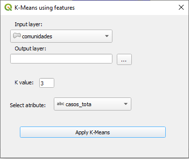
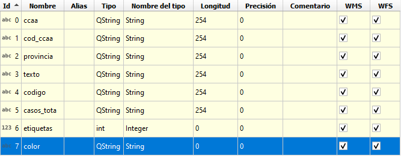
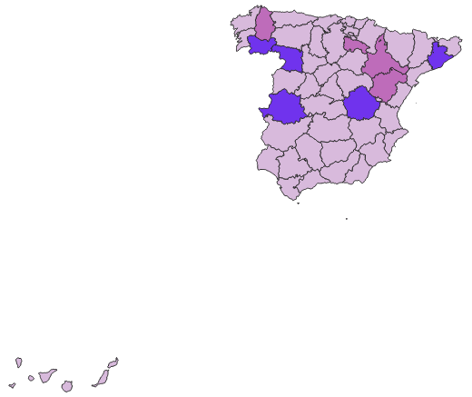

# K-Means plugin
> Experimental plugin developed with educational purpose 

## Tools:

- [pb_tool](http://g-sherman.github.io/plugin_build_tool/)
- QtDesigner with Qgis 3.10.6

## Funcionality:

The addition of a column 'labels' which contains the k-cluster label and another column 'color' which has hex random color for each k value. 

Plugin window: 

Table with new attributes 

Layer after segmentation based in feature 

